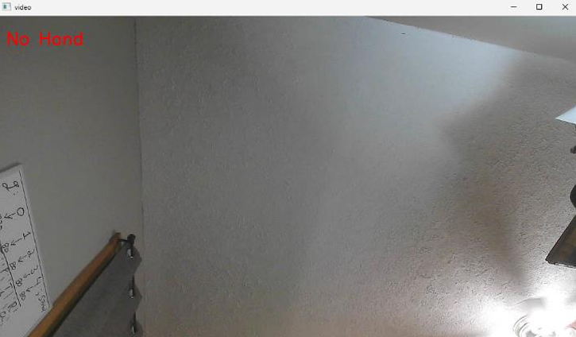
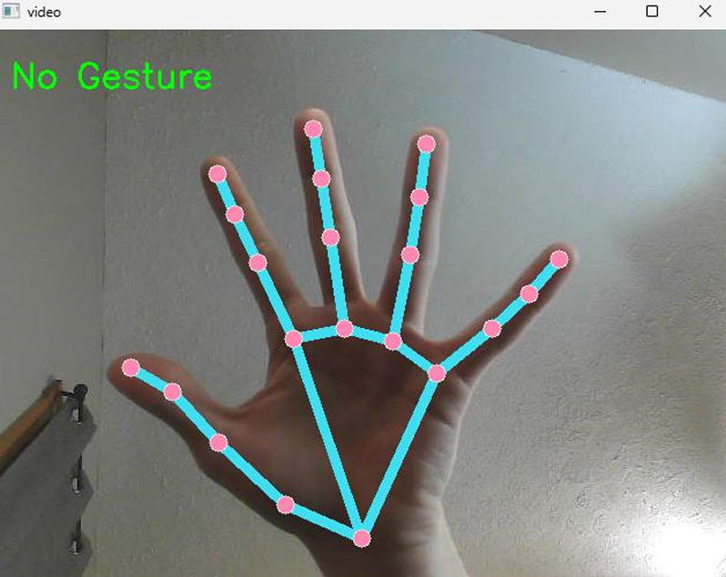
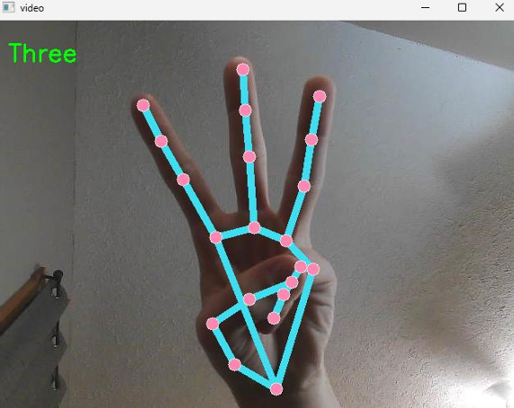
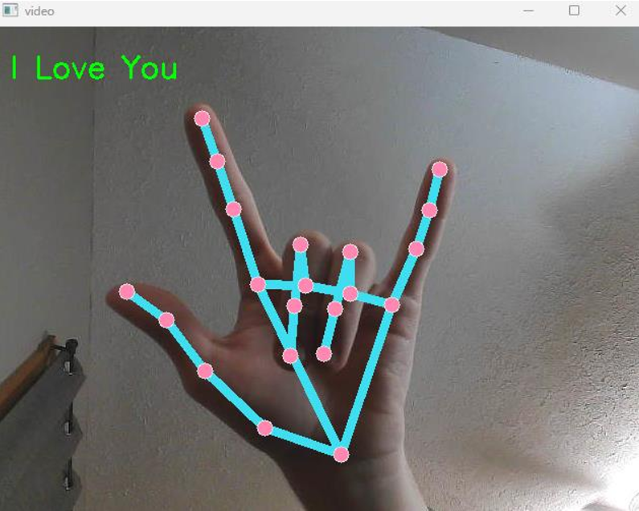
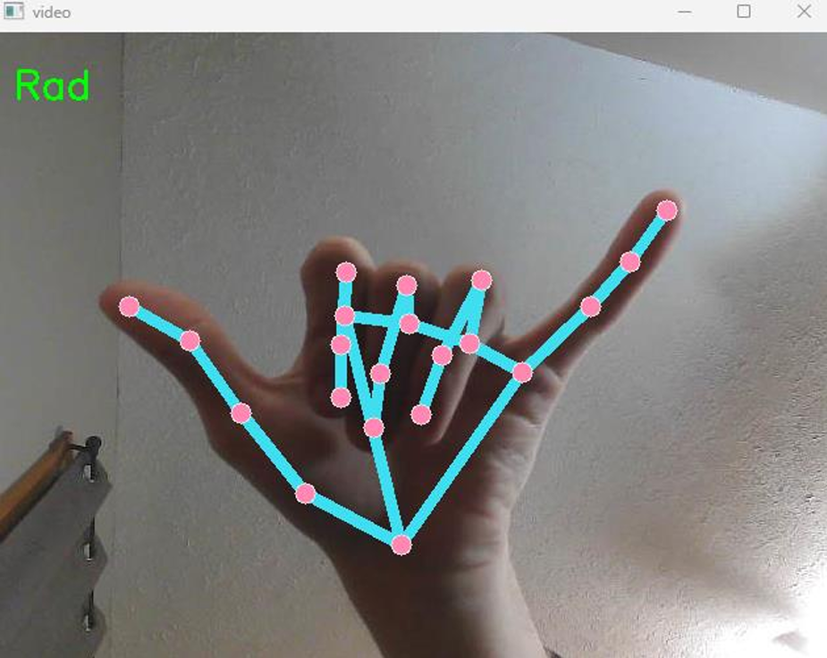
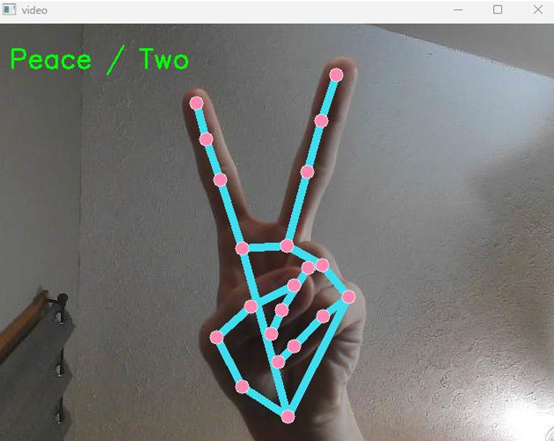

# GRIP-Hand_Gesture_Recognition
Hand gesture recognition software driven by Mediapipe's pre-trained landmark detection model, combined with a custom neural network to classify hand gestures.

# Pre-Trained Model's Gestures
This repo includes a pre-trained model capable of recognizing four distinct hand gestures, as well as detecting when none of these gestures are performed. The six figures below illustrate the model’s predictions, indicating either the identified gesture or the presence of a hand in the camera’s view.
<table>
  <tr>
	<td> </td>
	<td> </td>
	
  </tr>
  <tr>
	<td> </td>
    <td> </td>
  </tr>
  <tr>
	<td> </td>
	<td> </td>
  </tr>
</table>

# How To Run (handGestureRun.py)
	
 	1. Using VSCode open project file in structure
		- GRIP
		  |
		  +-- handGestureSetup.py
		  |
		  +-- handGestureRun.py
		  |
		  +-- models
		  |	  |
		  |	  +-- 03_HandGesture_Binary.pth
	
	2. Dependencies:
		-Python v3.11.9
		-Libraries
			- Mediapipe (pip install mediapipe)
			- OpenCV (pip install opencv-python)
			- numpy (pip install numpy)
			- Pytorch (https://pytorch.org/get-started/locally/)
   
	3. Clicking run will pop open a window which displays the webcam or camera connectd to your computer. 
 	The AI model is trained on the left hand (palm facing forward) only and can only track
	one hand at a time.

# NOTE
- "handGestureSetup.py" -> file used to intialize, create, and train AI model.
- "handGestureRun.py" -> file used to run trained models.
